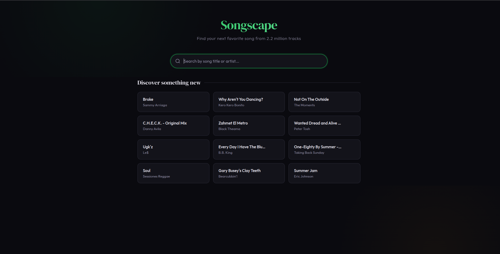
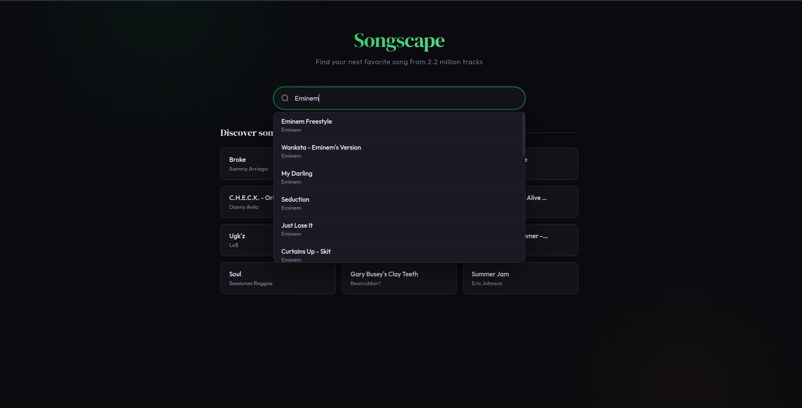
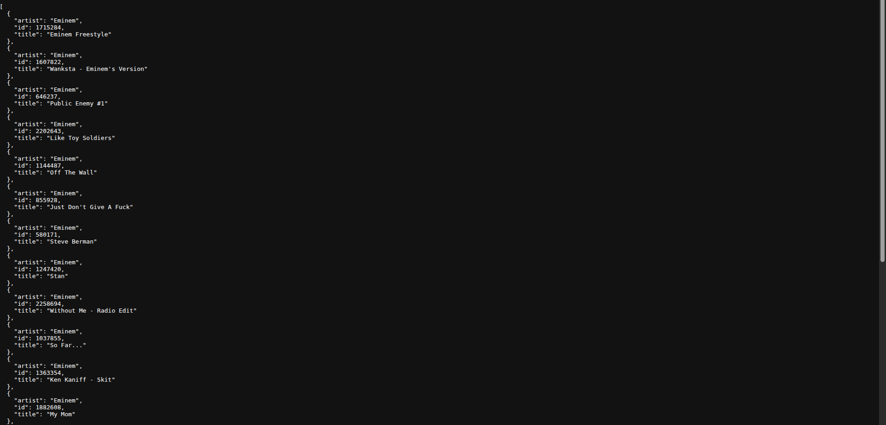
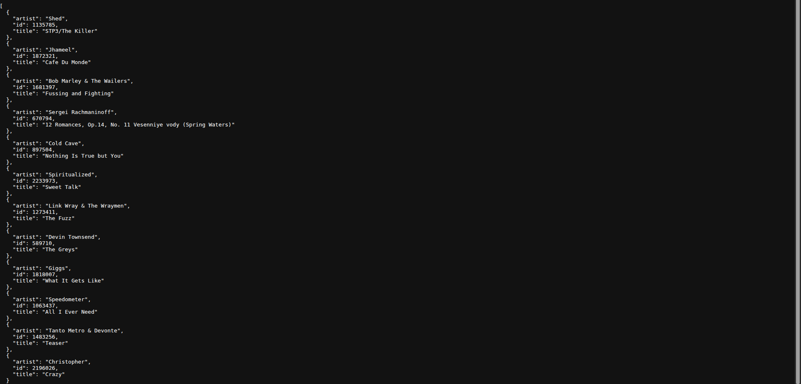

# Songscape

Find similar songs from a library of 2.2 million tracks. Select any song and get instant recommendations powered by Word2Vec embeddings and vector similarity search.



## How It Works

Each song has a 32-dimensional Word2Vec embedding that captures its musical characteristics. When you pick a song, FAISS finds the nearest vectors in that embedding space and returns the closest matches. MongoDB stores the song metadata and handles text search for the search bar.

## Tech Stack

- **Flask** -- Python web framework serving the API and frontend
- **MongoDB** -- stores song titles and artists, powers the text search
- **FAISS** -- vector similarity search across 2.2 million embeddings
- **NumPy** -- embedding loading and L2 normalization
- **Word2Vec** -- pre-trained 32-dimensional song embeddings

## Setup

```bash
python -m venv venv
source venv/bin/activate
pip install -r requirements.txt
```

Place the two data files in the `data/` directory:
- `meta_word2vec_2M.tsv` -- song titles and artists
- `emb_word2vec_2M.tsv` -- 32-dimensional embeddings

Build the index (run once, takes about 1 minute):

```bash
python build_index.py
```

Start the app:

```bash
python app.py
```

Open `http://localhost:5000`.

## Search

Type any song title or artist name to get suggestions.



## API

| Endpoint | Description |
|----------|-------------|
| `GET /api/search?q=` | Search by title or artist |
| `GET /api/recommend?id=&n=` | Get similar songs (max 50) |
| `GET /api/random` | Get 12 random songs |

**Search for Eminem songs:**
```bash
curl "http://localhost:5000/api/search?q=eminem"
```


**Get random songs:**
```bash
curl "http://localhost:5000/api/random"
```

